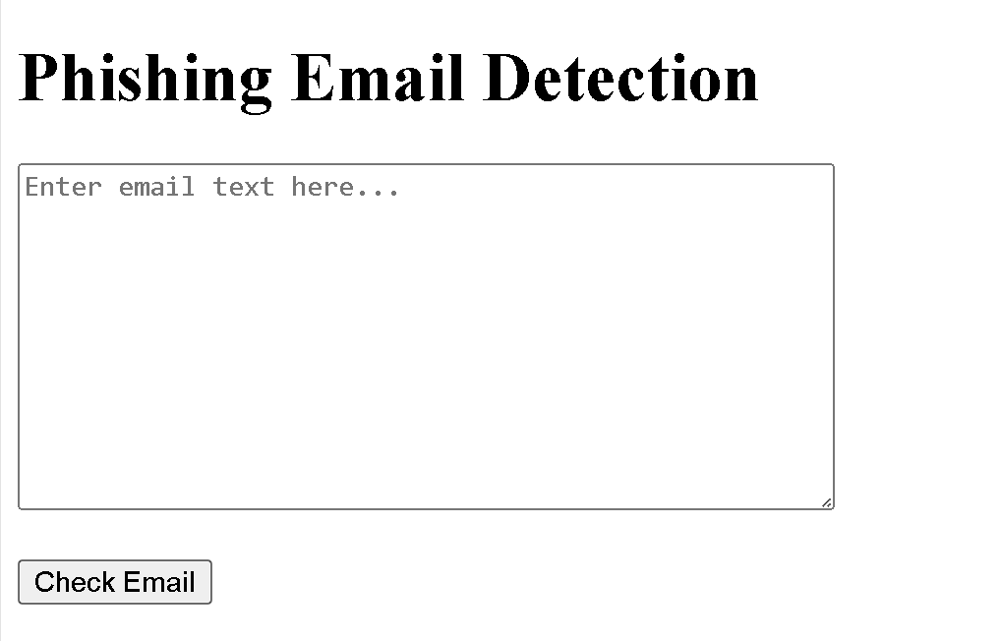
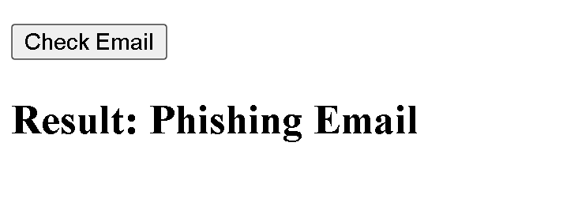

# 🛡️ Email Phishing Detection System

## 📋 Description

A machine learning-powered web application that analyzes email content to detect potential phishing attempts. This system uses natural language processing and classification algorithms to help users identify suspicious emails and protect themselves from phishing attacks.

The application provides a simple, user-friendly interface where users can paste email content and receive instant feedback on whether the email is likely to be a phishing attempt or legitimate communication.

## ✨ Features

- **Real-time Email Analysis**: Instant classification of email content as phishing or safe
- **Machine Learning Backend**: Uses trained ML models for accurate detection
- **Web Interface**: Clean, responsive web interface for easy interaction
- **TF-IDF Vectorization**: Advanced text processing for feature extraction
- **Pre-trained Models**: Comes with pre-trained phishing detection model
- **Flask Web Framework**: Lightweight and fast web application
- **Cross-platform**: Runs on Windows, macOS, and Linux

## 🛠️ Tech Stack

- **Backend**: Python 3.x
- **Web Framework**: Flask
- **Machine Learning**: scikit-learn
- **Text Processing**: TF-IDF Vectorization
- **Model Persistence**: joblib
- **Frontend**: HTML5, CSS3
- **Template Engine**: Jinja2

## 📦 Installation

### Prerequisites
- Python 3.7 or higher
- pip (Python package installer)

### Step-by-Step Installation

1. **Clone the repository**
   ```bash
   git clone https://github.com/yourusername/Email_Phishing.git
   cd Email_Phishing
   ```

2. **Create a virtual environment** (recommended)
   ```bash
   python -m venv venv
   
   # On Windows
   venv\Scripts\activate
   
   # On macOS/Linux
   source venv/bin/activate
   ```

3. **Install required dependencies**
   ```bash
   pip install flask joblib scikit-learn numpy pandas
   ```

4. **Verify model files exist**
   Ensure the following files are present in the project directory:
   - `phishing_email_model.pkl`
   - `tfidf_vectorizer.pkl`

5. **Run the application**
   ```bash
   python app.py
   ```

6. **Access the application**
   Open your web browser and navigate to: `http://localhost:5000`

## 🚀 Usage

### Basic Usage

1. **Start the application** by running `python app.py`
2. **Open your browser** and go to `http://localhost:5000`
3. **Paste email content** into the text area
4. **Click "Check Email"** to analyze the content
5. **View the result** - the system will display whether the email is "Phishing Email" or "Safe Email"

### Example Email Texts to Test

**Suspicious/Phishing Email Example:**
```
Urgent! Your account will be suspended immediately. Click here to verify your credentials: http://suspicious-link.com/verify
Send your password to confirm your identity.
```

**Legitimate Email Example:**
```
Hello,
Thank you for your recent purchase. Your order #12345 has been shipped and will arrive within 3-5 business days.
Best regards,
Customer Service Team
```

### API Usage

The application also accepts POST requests to the `/predict` endpoint:

```python
import requests

data = {'email_text': 'Your email content here'}
response = requests.post('http://localhost:5000/predict', data=data)
```

## 📸 Screenshots

### Main Interface

*Screenshot of the main email analysis interface*

### Detection Result

*Screenshot showing phishing detection result*

> **Note**: Add actual screenshots to the `screenshots/` directory and update the paths above.

## 📁 Project Structure

```
Email_Phishing/
├── app.py                      # Main Flask application
├── phishing_email_model.pkl    # Trained ML model
├── tfidf_vectorizer.pkl       # TF-IDF vectorizer
├── templates/
│   └── index.html             # Web interface template
├── screenshots/               # Application screenshots
├── requirements.txt           # Project dependencies
└── README.md                 # Project documentation
```

## 🤝 Contributing

We welcome contributions to improve the Email Phishing Detection System! Here's how you can contribute:

### How to Contribute

1. **Fork the repository**
2. **Create a feature branch**
   ```bash
   git checkout -b feature/your-feature-name
   ```
3. **Make your changes** and ensure they work properly
4. **Add tests** if applicable
5. **Commit your changes**
   ```bash
   git commit -m "Add: description of your feature"
   ```
6. **Push to your branch**
   ```bash
   git push origin feature/your-feature-name
   ```
7. **Create a Pull Request**

### Contribution Guidelines

- Follow Python PEP 8 style guidelines
- Write clear, descriptive commit messages
- Test your changes thoroughly
- Update documentation if necessary
- Ensure backward compatibility

### Areas for Improvement

- [ ] Add more sophisticated ML models
- [ ] Implement email header analysis
- [ ] Add batch email processing
- [ ] Improve UI/UX design
- [ ] Add API documentation
- [ ] Implement user authentication
- [ ] Add email source verification

## 📄 License

This project is licensed under the MIT License - see the [LICENSE](LICENSE) file for details.

```
MIT License

Copyright (c) 2025 [Your Name]

Permission is hereby granted, free of charge, to any person obtaining a copy
of this software and associated documentation files (the "Software"), to deal
in the Software without restriction, including without limitation the rights
to use, copy, modify, merge, publish, distribute, sublicense, and/or sell
copies of the Software, and to permit persons to whom the Software is
furnished to do so, subject to the following conditions:

The above copyright notice and this permission notice shall be included in all
copies or substantial portions of the Software.

THE SOFTWARE IS PROVIDED "AS IS", WITHOUT WARRANTY OF ANY KIND, EXPRESS OR
IMPLIED, INCLUDING BUT NOT LIMITED TO THE WARRANTIES OF MERCHANTABILITY,
FITNESS FOR A PARTICULAR PURPOSE AND NONINFRINGEMENT. IN NO EVENT SHALL THE
AUTHORS OR COPYRIGHT HOLDERS BE LIABLE FOR ANY CLAIM, DAMAGES OR OTHER
LIABILITY, WHETHER IN AN ACTION OF CONTRACT, TORT OR OTHERWISE, ARISING FROM,
OUT OF OR IN CONNECTION WITH THE SOFTWARE OR THE USE OR OTHER DEALINGS IN THE
SOFTWARE.
```

## 📞 Contact

**Project Maintainer**: Nagendra Pai
- 📧 Email: painagendrao228@gmail.com

## 🙏 Acknowledgments

- Thanks to the scikit-learn team for the excellent machine learning library
- Flask community for the lightweight web framework
- Contributors and testers who helped improve this project

---

⭐ **If you find this project helpful, please consider giving it a star!** ⭐
